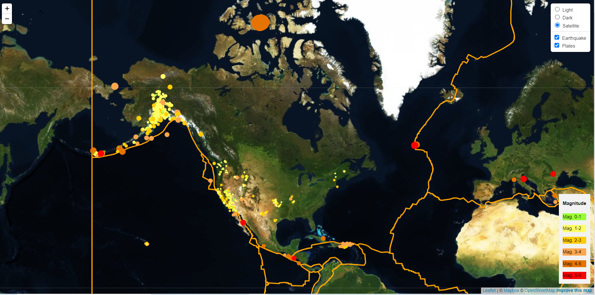

# Visualising Earthquake Data with Leaflet

- Data markers reflect the magnitude of the earthquake in their size and colour
- Include popups that provide additional information about the earthquake when a marker is clicked

## Data source

https://earthquake.usgs.gov/earthquakes/feed/v1.0/geojson.php

## Visualisation

 